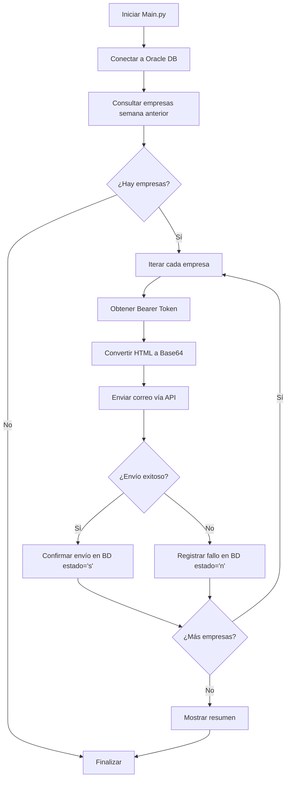

# 📧 Sistema de Envío Automatizado de Correos

<div align="center">


</div>

---

## 📋 Descripción

Sistema automatizado de envío de correos electrónicos para nuevas empresas matriculadas. 

El sistema consulta automáticamente la base de datos Oracle, obtiene las empresas matriculadas en la semana anterior y les envía correos de bienvenida personalizados con información sobre beneficios empresariales, registrando el estado de cada envío.

---

## 🎯 Características Principales

- ✅ **Consulta automática a Oracle DB** - Obtiene empresas de la semana anterior
- ✅ **Envío masivo personalizado** - Correos personalizados por empresa
- ✅ **Autenticación Bearer Token** - Seguridad en todas las APIs
- ✅ **Conversión HTML a Base64** - Procesamiento de plantillas HTML
- ✅ **Gestión de caracteres especiales** - Soporte completo para español (á, é, í, ó, ú, ñ)
- ✅ **Confirmación de envío en BD** - Registro del estado de cada correo
- ✅ **URLs de seguimiento** - Links dinámicos con matrícula para tracking
- ✅ **Manejo robusto de errores** - Validaciones y recuperación ante fallos
- ✅ **Copia automática** - Envío de copia a correo corporativo

---

## 📁 Estructura del Proyecto

```
Correo-Automatizacion-HTML/
│
├── Main.py                          # 🚀 Punto de entrada principal
│
├── API/                             # 📡 Módulos de integración API
│   ├── send_email.py                #    └─ Envío de correos
│   ├── ObtenerToken.py              #    └─ Autenticación Bearer
│   └── ConfirmaEnvio.py             #    └─ Confirmación en BD
│
├── Database/                        # 🗄️ Conexión y consultas Oracle
│   └── OracleConnection.py          #    └─ Gestión de BD
│
├── HTML/                            # 🎨 Procesamiento de plantillas
│   ├── Base64Converter.py           #    └─ Conversión HTML → Base64
│   └── index.html                   #    └─ Plantilla de correo
│
├── .env                             # 🔐 Variables de entorno (credenciales)
├── requirements.txt                 # 📦 Dependencias Python
└── README.md                        # 📖 Este archivo
```

---

## 🔧 Tecnologías Utilizadas

| Tecnología        | Versión | Propósito                       |
| ----------------- | ------- | ------------------------------- |
| **Python**        | 3.13+   | Lenguaje principal              |
| **oracledb**      | 2.0+    | Cliente Oracle Database         |
| **requests**      | 2.31+   | Llamadas HTTP a APIs            |
| **python-dotenv** | 1.0+    | Gestión de variables de entorno |

---

## 📦 Instalación

### 1️⃣ Clonar el repositorio

```bash
git clone https://github.com/Ospina115/Correo-Automatizacion-HTML.git
cd Correo-Automatizacion-HTML
```

### 2️⃣ Instalar dependencias

```bash
pip install -r requirements.txt
```

### 3️⃣ Configurar variables de entorno

Crea o edita el archivo `.env` con las siguientes credenciales:

```env
# -----------------------------
# Endpoints de las APIs
# -----------------------------
API_TOKEN_URL=https:api/para/obtener/token
API_FSEND_CORREO=https:api/para/enviar/correo
API_CONFIRMA_WHATS=https:api/para/confirmar/interaccion/usuario
API_CONFIRMA_ENVIO_URL=https:api/para/confirmar/envio/correo

# -----------------------------
# Credenciales de Autenticación
# -----------------------------
AUTH_USERNAME=tu_usuario
AUTH_PASSWORD=tu_contraseña

# -----------------------------
# Configuración de Api que envia correos
# -----------------------------
FSEND_EMAIL_COPIA=correocopia@prueba.com

# -----------------------------
# Configuración de Base de Datos
# -----------------------------
ORACLE_USER=tu_usuario
ORACLE_PASSWORD=tu_password
ORACLE_HOST=123.123.123
ORACLE_PORT=0000
ORACLE_SID=SIDDATABASE
```

---

## 🚀 Uso

### Ejecución del sistema

```bash
python Main.py
```

### Salida esperada

```
================================================================================
SISTEMA DE ENVÍO DE CORREOS - EMPRESAS NUEVAS
================================================================================

Conectando a la base de datos Oracle...
✓ Conexión exitosa a Oracle Database

Ejecutando consulta...
✓ Se encontraron 5 empresa(s) matriculada(s) la semana anterior

✓ Conexión cerrada

================================================================================
PROCESANDO 5 EMPRESA(S)
================================================================================

[1/5] Procesando:
  • Empresa: EMPRESA EJEMPLO S.A.S
  • Matrícula: 123456
  • Correo: contacto@empresaejemplo.com
  ✓ El ingreso se realizo correctamente: 1 Registros en la orden #...
  ℹ Confirmando envío en BD...
  ✓ Confirmación registrada en BD

[2/5] Procesando:
  ...

================================================================================
RESUMEN DE ENVÍO
================================================================================
Total procesadas: 5
Exitosos: 5
Fallidos: 0
================================================================================
```

---

## 🔄 Flujo de Trabajo



---

## 📧 Plantilla de Correo

### Variables dinámicas

La plantilla HTML (`HTML/index.html`) utiliza las siguientes variables:

| Variable           | Descripción          | Ejemplo                            |
| ------------------ | -------------------- | ---------------------------------- |
| `{{COMPANY_NAME}}` | Nombre de la empresa | "EMPRESA EJEMPLO S.A.S"            |
| Link del botón     | URL con matrícula    | `{API_CONFIRMA_WHATS}/{matricula}` |

### Características de la plantilla

- 🎨 **Diseño responsivo** - Compatible con todos los clientes de correo
- 📱 **Mobile-friendly** - Optimizado para dispositivos móviles
- 🔤 **Entidades HTML** - Caracteres especiales convertidos (á → &aacute;)
- 🔗 **Link de seguimiento** - Botón con URL personalizada por matrícula
- 🖼️ **Imágenes optimizadas** - Logo y elementos visuales Cajasan

---

## 🔐 Seguridad

- 🔒 **Autenticación Bearer Token** - Todas las APIs requieren token
- 🔑 **Variables de entorno** - Credenciales nunca en código fuente
- ⚠️ **SSL Verification** - `verify=False` solo para APIs internas
- 🛡️ **Manejo de errores** - No expone información sensible

> **Nota**: El proyecto usa `verify=False` porque las APIs internas de Cajasan tienen certificados autofirmados. En producción con APIs públicas, esto debe cambiarse a `verify=True`.

---

## 🗄️ Base de Datos

### Consulta utilizada

```sql
SELECT * FROM database.table
WHERE TO_CHAR(FECHA_MATRICULA,'IYYYIW') = TO_CHAR(SYSDATE,'IYYYIW') - 1
```

### Campos utilizados

- `RAZON_SOCIAL` - Nombre de la empresa
- `MATRICULA` - Número de matrícula
- `CORREO` - Email de contacto

---

## 📊 APIs Utilizadas

### 1. API de Autenticación

- **Endpoint**: `API_TOKEN_URL`
- **Método**: POST
- **Retorna**: Bearer Token

### 2. API de Envío de Correos

- **Endpoint**: `API_FSEND_CORREO`
- **Método**: POST
- **Auth**: Bearer Token
- **Payload**:
  
  ```json
  {
    "producto_cobro": "Payload",
    "email": "destinatario@ejemplo.com;copia@prueba.com",
    "asunto": "Bienvenido...",
    "body_base64": "PGh0bWw+Li4uPC9odG1sPg=="
  }
  ```

### 3. API de Confirmación de Envío

- **Endpoint**: `API_CONFIRMA_ENVIO_URL/{matricula}/{estado}`
- **Método**: GET
- **Auth**: Bearer Token
- **Estados**: 
  - `s` = Enviado exitosamente
  - `n` = Error en el envío

---

## ⚠️ Manejo de Errores

El sistema maneja los siguientes escenarios:

| Error                        | Acción                                            |
| ---------------------------- | ------------------------------------------------- |
| **Empresa sin correo**       | Se omite y se registra como fallido               |
| **Error 500 (API)**          | Se identifica como posible error de autenticación |
| **Timeout**                  | Se registra y continúa con la siguiente empresa   |
| **Error de conexión**        | Se registra y continúa                            |
| **Fallo en confirmación BD** | Se marca como advertencia (correo enviado)        |

---

## 📈 Estadísticas

Al finalizar, el sistema muestra:

- ✅ **Total procesadas** - Cantidad de empresas consultadas
- ✅ **Exitosos** - Correos enviados correctamente
- ❌ **Fallidos** - Correos que no se pudieron enviar
- ⚠️ **Errores de autenticación** - Fallos 500 del servidor

---

## 🤝 Contribuciones

Este proyecto es de uso interno de **Cajasan**. Para contribuciones o mejoras, contactar al equipo de desarrollo.

---

## 👨‍💻 Autor

**Samuel Ospina - Desarrollador**

- 📧 Email: Ospina31@icloud.com
- 🌐 Web: [www.cajasan.com](https://www.cajasan.com)

---

## 📝 Licencia

Proyecto de uso interno - Cajasan © 2025

---

<div align="center">

**Hecho con ❤️ para Cajasan - Santander**
